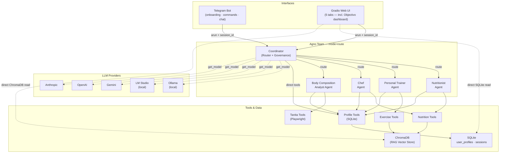
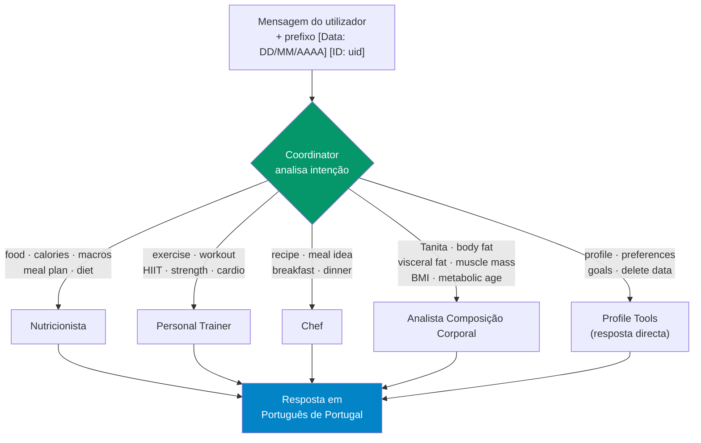
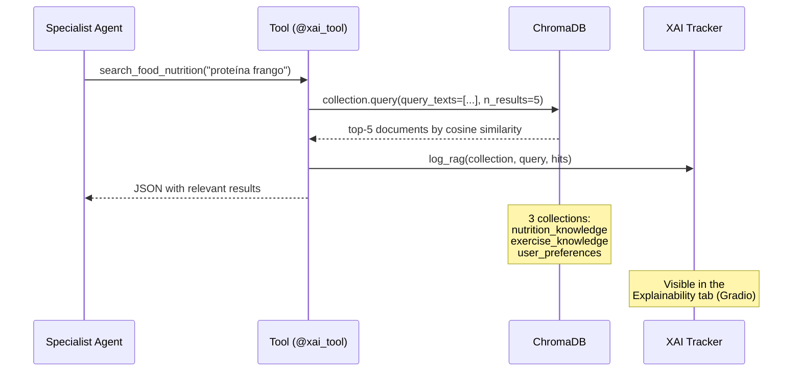
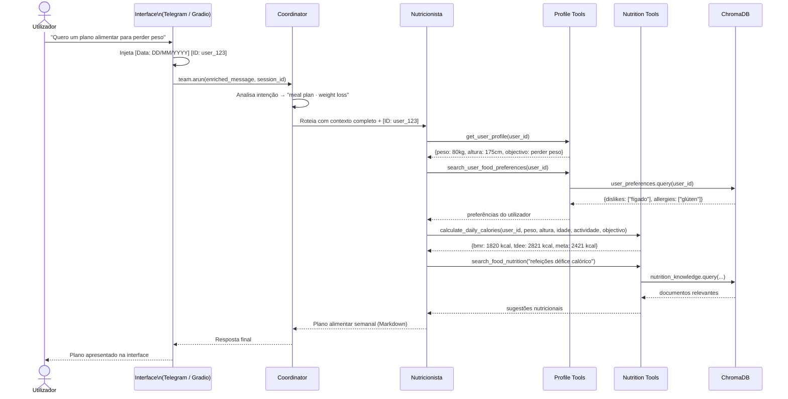
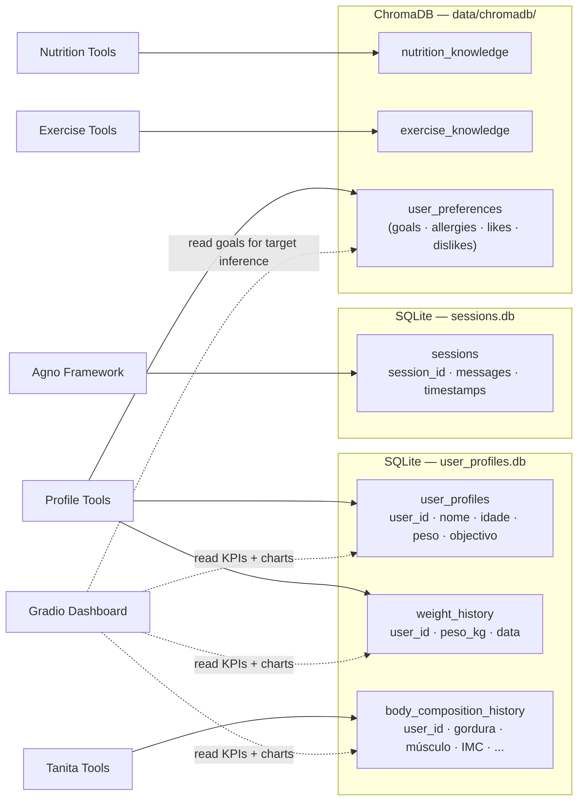
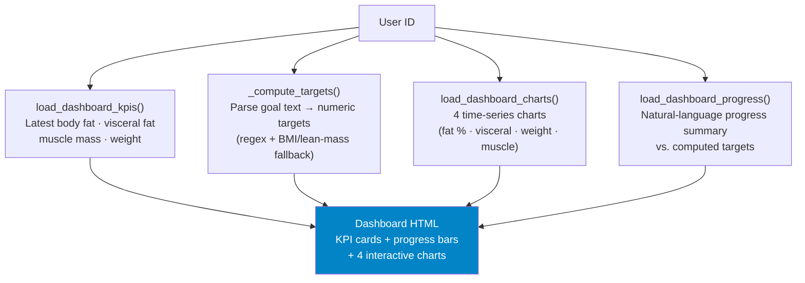

# Architecture — MyHealthAssistant

Multi-agent personal health system built with [Agno](https://github.com/agno-agi/agno), ChromaDB, and support for 5 LLM providers.

---

## 1. Component overview

---

## 2. Routing by the Coordinator

The Coordinator uses Agno's `mode="route"`: it analyses the message, selects **one** specialist, and passes the full context to it.

**Governance rules enforced by the Coordinator before routing:**
- Refuses extreme caloric restrictions (`< 800 kcal/day`)
- Refuses medical diagnoses or prescriptions
- Refuses requests outside the health domain
- Injects previous message context into follow-ups
- **Forwards user ID:** every routed task begins with `[Data de hoje: DD/MM/AAAA] [ID do utilizador: <UID>]` so specialists always call tools with the correct user account

---

## 3. RAG query (ChromaDB)

Each specialist agent queries the vector knowledge base before responding.

**ChromaDB collections:**

| Collection | Content | Filter |
|---|---|---|
| `nutrition_knowledge` | Foods, macros, diets, supplements | `type = "nutrition"` |
| `exercise_knowledge` | Exercises, muscle groups, plans | `type = "exercise"` |
| `user_preferences` | Preferences, allergies, restrictions, goals | `user_id + category` |

---

## 4. Sequence diagram — typical conversation

---

## 5. Data persistence

**Goals sync:** when a goal is saved via Telegram or Gradio it is written to both ChromaDB (`user_preferences`, category `goals`) and to the `goal` column in `user_profiles`. This ensures agents have full context via RAG and the Objectivo dashboard can compute personalised numeric targets without an LLM call.

---

## 6. Objectivo Dashboard (Gradio)

The **🎯 Objectivo** tab provides a real-time health progress view by reading directly from SQLite and ChromaDB — no agent call required.

**Target inference logic (`_compute_targets`):**
1. Read all goals from ChromaDB (`user_preferences`, category `goals`) — supports users with multiple simultaneous goals
2. Extract numeric targets via regex patterns (weight kg, fat %, visceral level)
3. Infer missing targets from defined ones using the user's current muscle-to-lean-mass ratio
4. BMI formula fallback for weight if no explicit target is found

---

## 7. Architecture decisions

| Decision | Choice | Rationale |
|---|---|---|
| Agent framework | Agno | Native `mode="route"`, SQLite session management, automatic tool calling |
| Vector store | ChromaDB | Local persistence, no external server, default embedding sufficient for this domain |
| Database | SQLite | Zero configuration, WAL mode for Gradio/Telegram concurrency |
| LLM | Configurable (5 providers) | Avoids vendor lock-in; allows local execution (privacy) or cloud (performance) |
| Interfaces | Telegram + Gradio | Telegram for mobile/daily use; Gradio for demo, dashboard and administration |
| Tanita automation | Playwright | MyTanita portal has no public API; controlled scraping encapsulated in a tool |
| Output language | European Portuguese | Target audience; enforced in the Coordinator's system prompt |
| Dashboard reads | Direct SQLite/ChromaDB | Avoids LLM latency for purely data-driven views; keeps agent calls for natural-language tasks |
| Goals storage | ChromaDB + SQLite sync | ChromaDB for semantic agent queries; SQLite for fast dashboard target inference |
| User ID forwarding | Coordinator instruction | Guarantees all specialist tool calls use the correct account regardless of routing depth |
