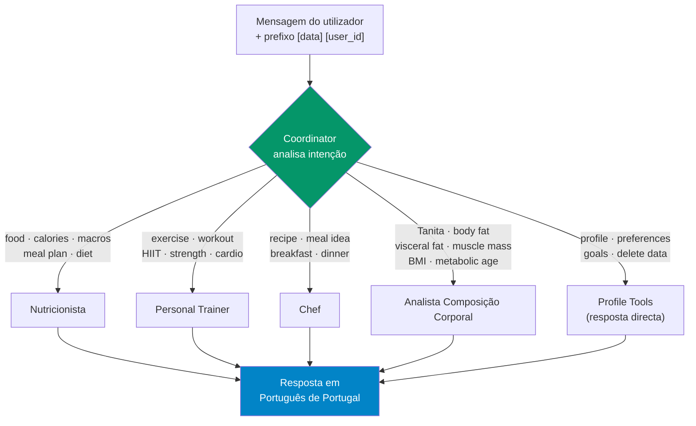
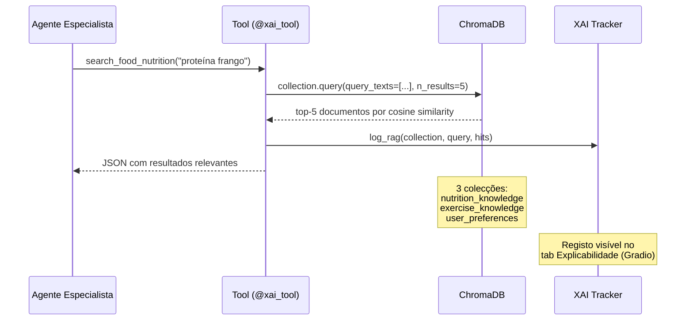
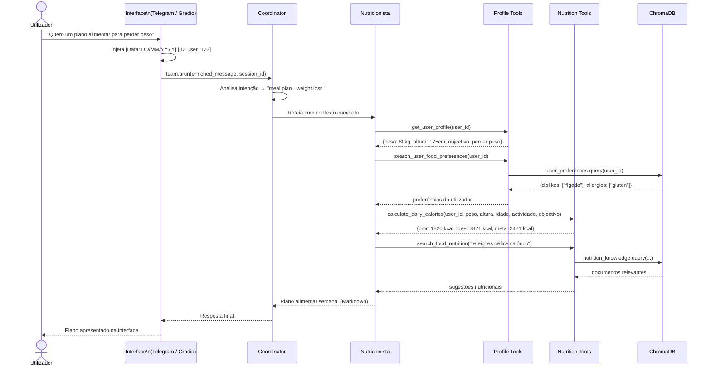
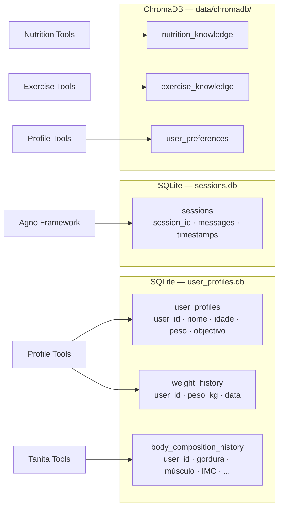

# Arquitectura — MyHealthAssistant

Sistema multi-agente de saúde pessoal construído com [Agno](https://github.com/agno-agi/agno), ChromaDB e suporte a 5 LLM providers.

---

## 1. Visão geral dos componentes

```mermaid
graph TB
    subgraph Interfaces
        TG["Telegram Bot"]
        GR["Gradio Web UI"]
    end

    subgraph agnoTeam["Agno Team — mode=route"]
        CO["Coordinator\n(Router + Governance)"]
        NU["Nutritionist\nAgent"]
        TR["Personal Trainer\nAgent"]
        CH["Chef\nAgent"]
        BC["Body Composition\nAnalyst Agent"]
    end

    subgraph Ferramentas & Dados
        PT["Profile Tools\n(SQLite)"]
        NT["Nutrition Tools"]
        ET["Exercise Tools"]
        TT["Tanita Tools\n(Playwright)"]
        KB["ChromaDB\n(RAG Vector Store)"]
        DB["SQLite\nuser_profiles · sessions"]
    end

    subgraph LLM Providers
        OL["Ollama\n(local)"]
        LS["LM Studio\n(local)"]
        GM["Gemini"]
        OA["OpenAI"]
        AN["Anthropic"]
    end

    TG -->|arun + session_id| CO
    GR -->|arun + session_id| CO

    CO -->|route| NU
    CO -->|route| TR
    CO -->|route| CH
    CO -->|route| BC
    CO -->|direct tools| PT

    NU --> NT & PT
    TR --> ET & PT
    CH --> NT & PT
    BC --> TT & PT

    NT & ET --> KB
    PT --> DB

    CO -.->|get_model()| OL & LS & GM & OA & AN
```

---

## 2. Routing pelo Coordinator

O Coordinator usa `mode="route"` do Agno: analisa a mensagem, selecciona **um** especialista e passa-lhe o contexto completo.



**Regras de governance aplicadas pelo Coordinator antes de rotear:**
- Recusa restrições calóricas extremas (`< 800 kcal/dia`)
- Recusa diagnósticos médicos ou prescrições
- Recusa pedidos fora do âmbito de saúde
- Injeta contexto de mensagens anteriores em follow-ups

---

## 3. Consulta RAG (ChromaDB)

Cada agente especialista consulta a base de conhecimento vectorial antes de responder.



**Colecções ChromaDB:**

| Colecção | Conteúdo | Filtro |
|---|---|---|
| `nutrition_knowledge` | Alimentos, macros, dietas, suplementos | `type = "nutrition"` |
| `exercise_knowledge` | Exercícios, grupos musculares, planos | `type = "exercise"` |
| `user_preferences` | Gostos, alergias, restrições, objectivos | `user_id + category` |

---

## 4. Diagrama de sequência — conversa típica



---

## 5. Persistência de dados



---

## 6. Decisões de arquitectura

| Decisão | Escolha | Justificação |
|---|---|---|
| Framework de agentes | Agno | `mode="route"` nativo, session management com SQLite, tool calling automático |
| Vector store | ChromaDB | Persistência local, sem servidor externo, embedding por defeito suficiente para este domínio |
| Base de dados | SQLite | Zero configuração, WAL mode para concorrência Gradio/Telegram |
| LLM | Configurável (5 providers) | Evita vendor lock-in; permite execução local (privacidade) ou cloud (desempenho) |
| Interfaces | Telegram + Gradio | Telegram para uso móvel/quotidiano; Gradio para demo e administração |
| Automação Tanita | Playwright | Portal MyTanita não tem API pública; scraping controlado e encapsulado numa tool |
| Linguagem de output | Português de Portugal | Público-alvo; enforced no system prompt do Coordinator |
