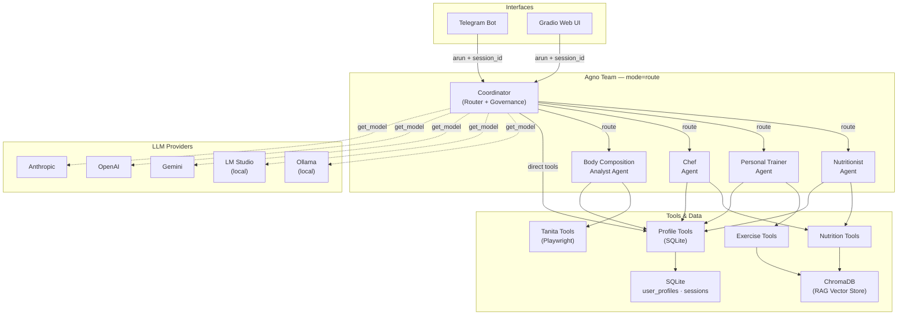
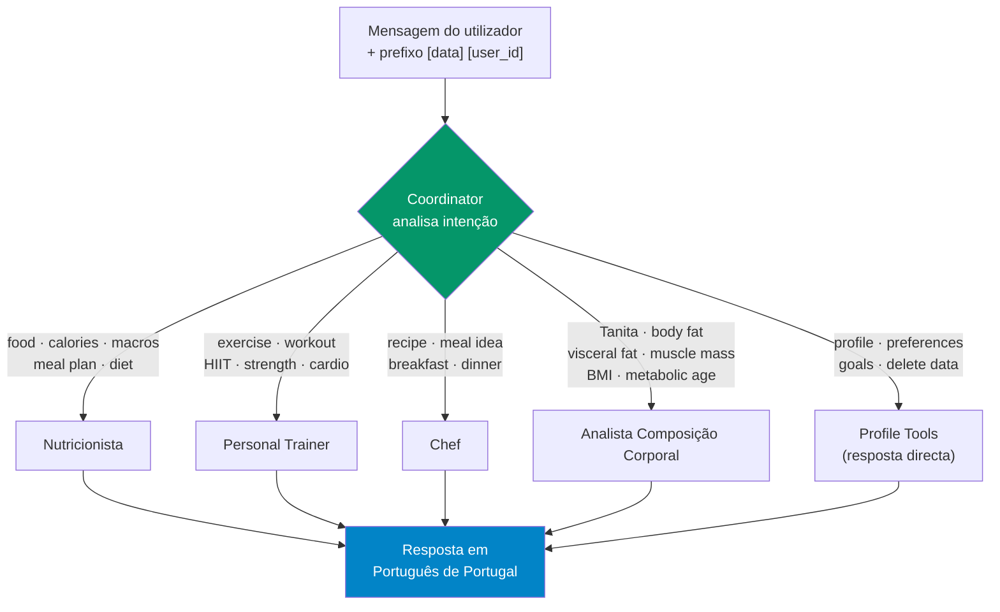
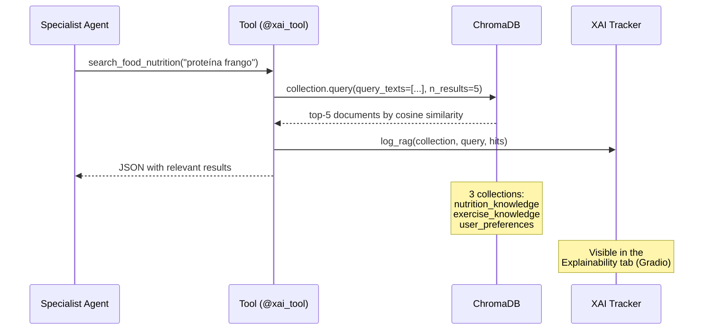
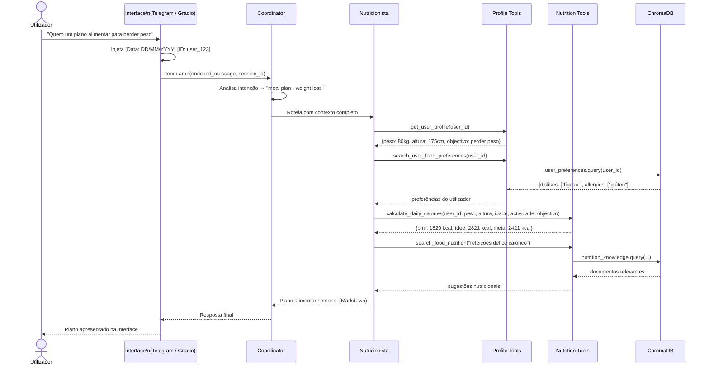
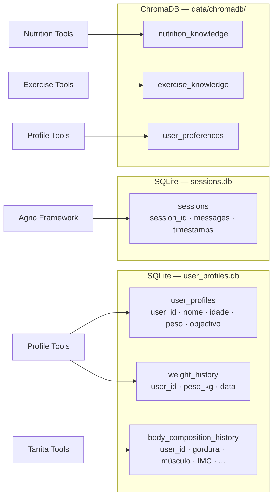

# Architecture — MyHealthAssistant

Multi-agent personal health system built with [Agno](https://github.com/agno-agi/agno), ChromaDB, and support for 5 LLM providers.

---

## 1. Component overview

---

## 2. Routing by the Coordinator

The Coordinator uses Agno's `mode="route"`: it analyses the message, selects **one** specialist, and passes the full context to it.

**Governance rules enforced by the Coordinator before routing:**
- Refuses extreme caloric restrictions (`< 800 kcal/day`)
- Refuses medical diagnoses or prescriptions
- Refuses requests outside the health domain
- Injects previous message context into follow-ups

---

## 3. RAG query (ChromaDB)

Each specialist agent queries the vector knowledge base before responding.

**ChromaDB collections:**

| Collection | Content | Filter |
|---|---|---|
| `nutrition_knowledge` | Foods, macros, diets, supplements | `type = "nutrition"` |
| `exercise_knowledge` | Exercises, muscle groups, plans | `type = "exercise"` |
| `user_preferences` | Preferences, allergies, restrictions, goals | `user_id + category` |

---

## 4. Sequence diagram — typical conversation

---

## 5. Data persistence

---

## 6. Architecture decisions

| Decision | Choice | Rationale |
|---|---|---|
| Agent framework | Agno | Native `mode="route"`, SQLite session management, automatic tool calling |
| Vector store | ChromaDB | Local persistence, no external server, default embedding sufficient for this domain |
| Database | SQLite | Zero configuration, WAL mode for Gradio/Telegram concurrency |
| LLM | Configurable (5 providers) | Avoids vendor lock-in; allows local execution (privacy) or cloud (performance) |
| Interfaces | Telegram + Gradio | Telegram for mobile/daily use; Gradio for demo and administration |
| Tanita automation | Playwright | MyTanita portal has no public API; controlled scraping encapsulated in a tool |
| Output language | European Portuguese | Target audience; enforced in the Coordinator's system prompt |
